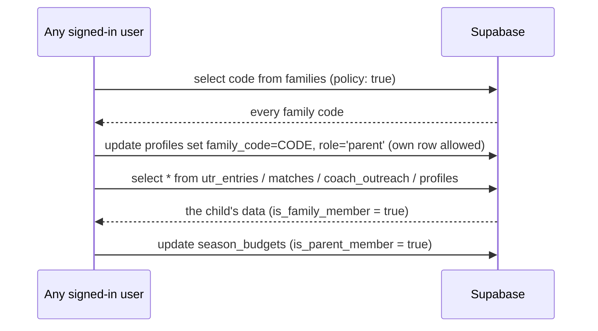
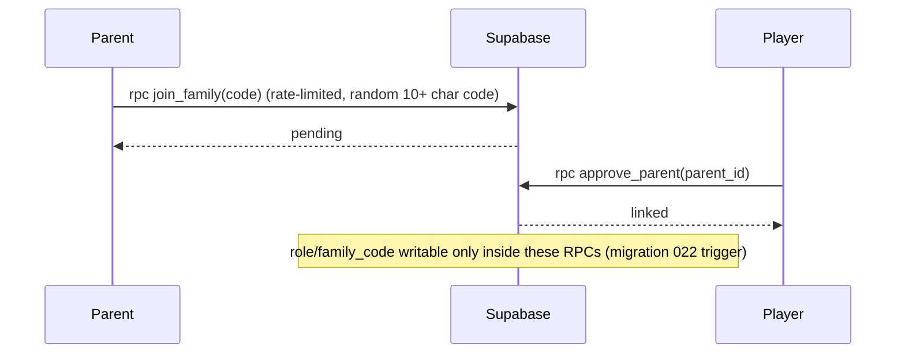

# Family access — today vs target

## Today (insecure — SECURITY_CHECKLIST S-2)

```mermaid
sequenceDiagram
  participant X as Any signed-in user
  participant DB as Supabase
  X->>DB: select code from families   (policy: true)
  DB-->>X: every family code
  X->>DB: update profiles set family_code=CODE, role='parent' (own row allowed)
  X->>DB: select * from utr_entries / matches / coach_outreach / profiles
  DB-->>X: the child's data (is_family_member = true)
  X->>DB: update season_budgets (is_parent_member = true)
```

## Target

```mermaid
sequenceDiagram
  participant P as Parent
  participant DB as Supabase
  participant K as Player
  P->>DB: rpc join_family(code)   (rate-limited, random 10+ char code)
  DB-->>P: pending
  K->>DB: rpc approve_parent(parent_id)
  DB-->>K: linked
  Note over DB: role/family_code writable only inside these RPCs (migration 022 trigger)
```
