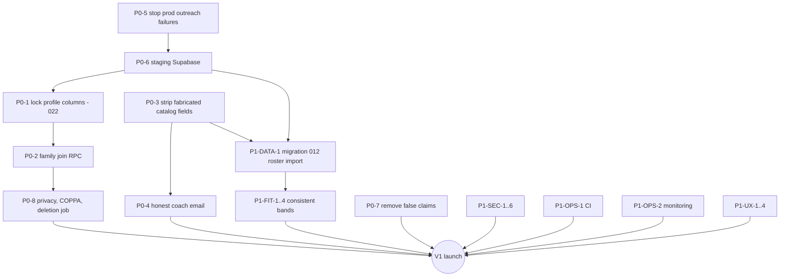

# V1 launch dependency graph

```mermaid
flowchart TD
  P05[P0-5 stop prod outreach failures] --> P06[P0-6 staging Supabase]
  P06 --> P01[P0-1 lock profile columns - 022]
  P01 --> P02[P0-2 family join RPC]
  P02 --> P08[P0-8 privacy, COPPA, deletion job]
  P03[P0-3 strip fabricated catalog fields] --> P04[P0-4 honest coach email]
  P03 --> D1[P1-DATA-1 migration 012 roster import]
  P06 --> D1
  D1 --> FIT[P1-FIT-1..4 consistent bands]
  P07[P0-7 remove false claims] --> LAUNCH
  SEC[P1-SEC-1..6] --> LAUNCH
  CI[P1-OPS-1 CI] --> LAUNCH
  MON[P1-OPS-2 monitoring] --> LAUNCH
  P04 --> LAUNCH((V1 launch))
  P08 --> LAUNCH
  FIT --> LAUNCH
  UX[P1-UX-1..4] --> LAUNCH
```
